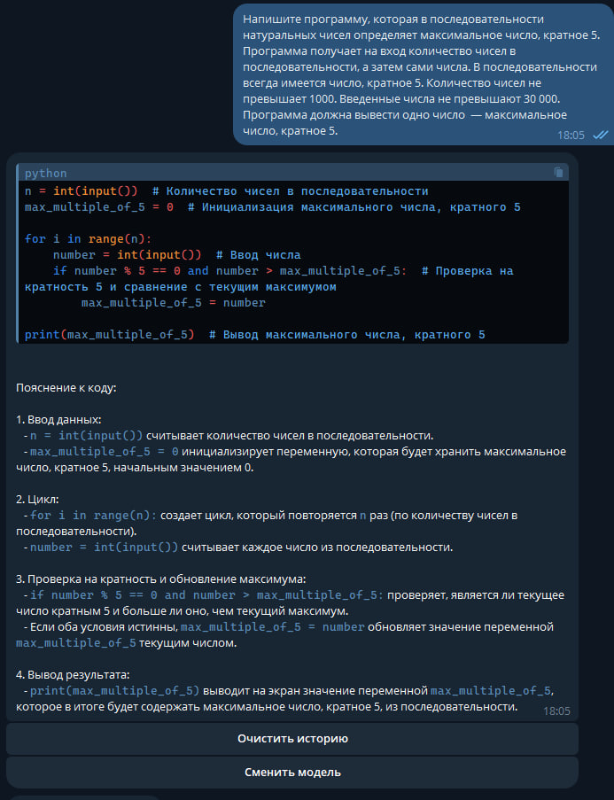

# Gemini API Telegram Bot

Этот бот предоставляет удобный доступ к возможностям Google Gemini прямо в Telegram. Общайтесь с продвинутым искусственным интеллектом, получайте ответы на вопросы, генерируйте креативный текст и многое другое!

## Возможности

* **Ответы на вопросы:** Задавайте вопросы на любую тему и получайте информативные и точные ответы.
* **Генерация текста:**  Создавайте различные виды текстового контента:  истории, статьи, стихи,  сценарии и т.д.
* **Перевод:**  Легко переводите текст на разные языки.
* **Резюмирование:**  Получайте краткие выжимки из длинных текстов.
* **Генерация идей:**  Используйте бота для мозгового штурма и генерации новых идей.
* **Помощь в написании кода:**  Получайте помощь в написании и отладке кода.

## Установка

1. **Клонируйте репозиторий:** `git clone https://github.com/MYRSGRAL/gemini-api-telegram-bot`
2. **Установите зависимости:** `pip install -r requirements.txt`
3. **Получите API ключ для Google Gemini:**  [https://ai.google.dev/gemini-api/docs/api-key?hl=ru]
4. **Создайте бота в Telegram:**  [https://t.me/BotHelp_Fatherbot]
5. **Настройте бота:**
    *  В файле `config.py` укажите свой API ключ для Google Gemini.
    *  Укажите токен вашего Telegram бота.

## Использование

1. **Запустите бота:** `python main.py`
2. **Найдите своего бота в Telegram.**
3. **Отправьте команду `/start` для начала общения.**
4. **Введите свой запрос или вопрос.**

## Примеры

* **"Напиши короткий рассказ о путешествии во времени"**
* **"Переведи 'Привет, мир!' на японский"**
* **"Какие есть способы решения проблемы изменения климата?"**

## Лицензия

MIT License

## Авторы

* **[MYRSGRAL](https://github.com/MYRSGRAL)** - основной разработчик.  Разработка основной логики бота, интеграция с API Gemini.
* **[Mikhail Khokhlov](https://github.com/Git-Mik)** - помощник разработчика.  Вклад в разработку форматирования текста и бета-тестирования.

